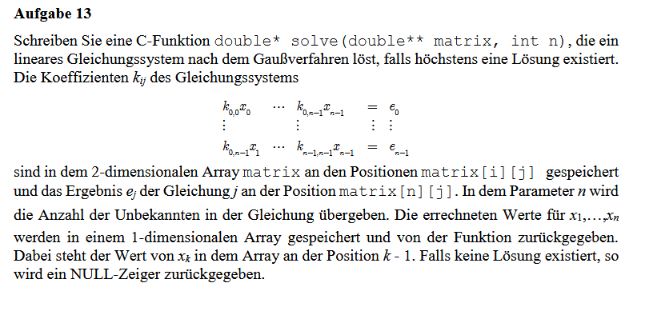

# Gaußsche Elimination in C

Dieses Projekt implementiert das Gaußsche Eliminationsverfahren zur Lösung linearer Gleichungssysteme in C.  
Der Kern der Berechnung befindet sich in der Datei `solve.c`.

## Inhalt

- `solve.c`: Enthält die Implementierung der Gauß-Elimination.
- `main.c`: Beispiel für die Nutzung der Funktion.
- `example.c`: Mehrere Gleichungssysteme als Beispiel für die Nutzung der Funktion.

## Aufgabenstellung

